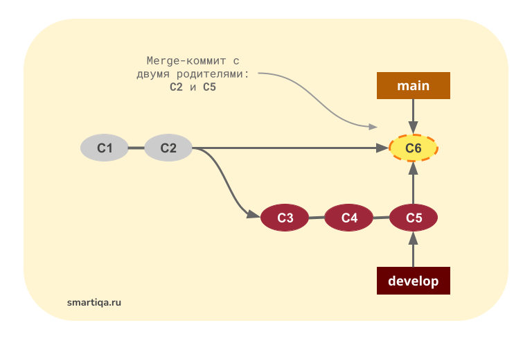

## **Инструкция по созданию репозитория Visio Studio Code (VSC)**  
---

1. Скачать и установить VSC и Git 
2. Открыть терминал.
3. Ввести 
    >git config --global [user.name] "Name"

    >git config --global user.email 
4. Создать папку в окне слева     
5. Необходимо инициировать. Ввести комманду в терминале **git init**
                         
## Работа в терминале. 
    Основные комманды.
    git add - добавление файла в который будем вносить комменты. Табом выбираем файл.  
    git commit -m "коммент"- внесение комментария
    git status - статус комментариев.
    git log - log изменений. Выбираем коммент => для перехода к нему первые 4 знака. 
    git diff - сравнение

## Стратегия слияния

1. Явное слияние 

Во время явного слияния создается так называемый merge-коммит. Основное предназначение этого коммита состоит в том, чтобы "соединить" изменения двух веток. У этого коммита есть одна особенность: два родительских коммита. Один родитель – последний коммит сливаемой ветки, второй – последний коммит целевой ветки.

Итак, git merge делает следующие шаги:
Проверяет, нет ли конфликтов, т.е. не удалят и не перепишут ли наши изменения какую-либо уже существующую информацию. Если возникает конфликт git merge останавливается, чтобы получить инструкции от пользователя, но этот случай мы рассмотрим ниже. А пока допустим, что конфликтов нет.
Добавляет все изменения из коммитов 3-5 в индекс ветки main
Делает коммит

 

2. Fast-forward
Во время неявного слияния не создается новых коммитов: используются только уже существующие. Суть этого слияния заключается в том, что из вливаемой ветки извлекаются несколько коммитов, а затем они применяются к последнему коммиту целевой ветки. Такое слияние называется fast-forward.

Режим fast-forward считается более удобным, поскольку в нем не нужно создавать лишних merge-коммитов, засоряющих историю репозитория. С другой стороны, если мы продолжим пользоваться веткой develop после fast-forward слияния, потом будет довольно трудно разобраться в ее истории. Так что каждый раз выполняя слияние, задумайтесь, хотите ли вы, чтобы оно прошло в режиме fast-forward, или для вас лучше явно создать merge-коммит, собирающий все воедино.

## Комманды git merge 

git merge <сливаемая ветка> 

>--ff - fast forward

>--no-ff  - отключить FF

>--ff only - остановить megre если его невозможно сделать FF.

>-- abort  - (конфликт) позволяет прервать слияние и вернуть все к началу операции

>-- continue  - (конфликт) Продалжает слияние после разрешения всех конфликтов

## Комманды для управления ветками

- **git branch** - делает новую ветку (для черновика например)
- **git checkout** “имя ветки” - переход в ветку
- **git merge** ”имя ветки” - переносит ветку в мастер
- **git branch** -d - удаляет ветку
-  - добавление фото
- **git log —graph** - графический лог

## **Работа с удаленными репозиториями**

**Комманды**:

- git clone (адресс ссылки GitHub) -создает копию 
- cd (имя папки) - переход в папку
- gip push - отправляет данные
- git push —set-upstream  - отправка изменений в чужой hub
- git push --set-upstream origin grupp_20 (добавили ветку grupp и когда пушим нужно добавить ветку)

- git pull - забирает данные
- git pull request

- fork - клонируем чужой git 

**Если собираемся производить корректировки в чужом репозитории, обязательно:**

1. Делаем Fork в наш дипазиторий. 
2. Делаем клон в git
3. Обязательно делаем свою ветку отличную от main
4. Вносим корректировки
5. Отправляем (пушим) не забываем что такой ветки нет создаем ее  "git push --set-upstream origin (имя ветки)"
6. В Git Hub нажимаем кнопку Pull Request 

